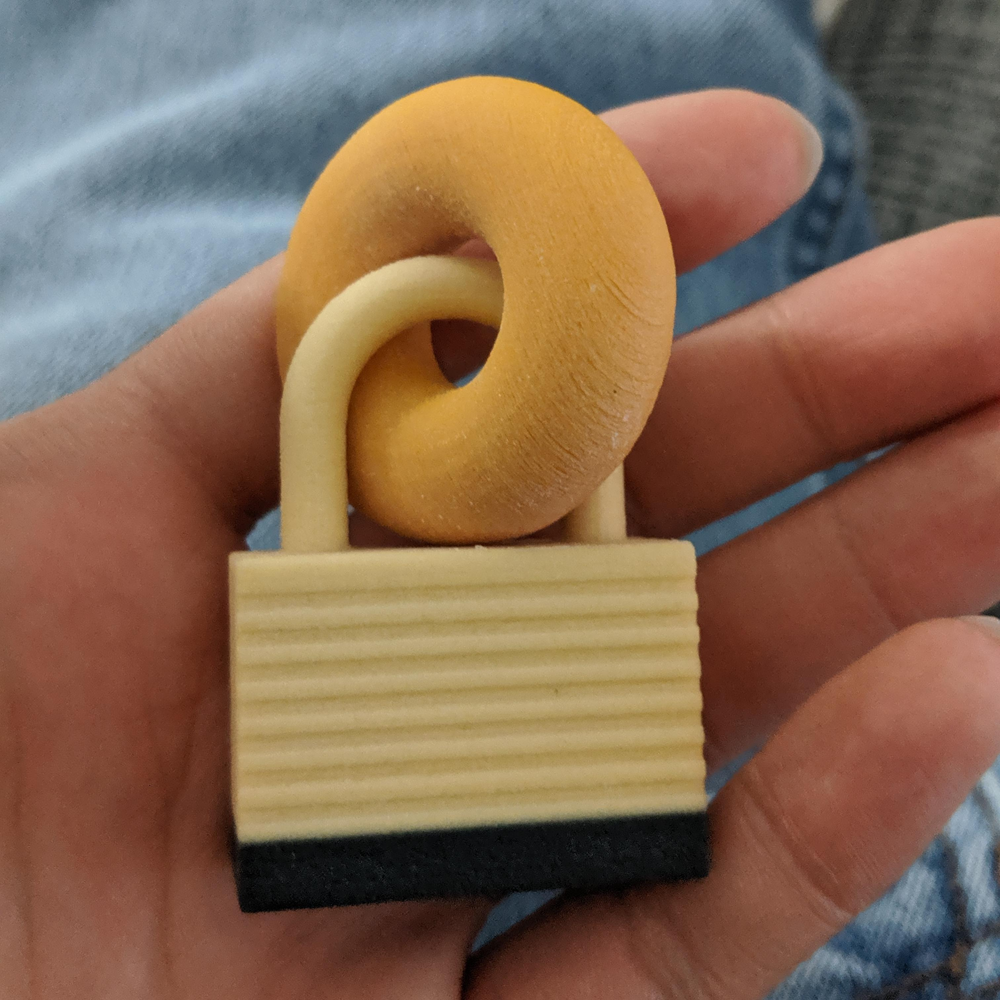

# model3d

This is a collection of tools for programmatically creating and manipulating 3D models, with some focus on 3D printing.

# Examples

The [examples](examples) directory has a lot of examples for how to use this library. A lot of these examples produce models which can be 3D printed. Here's my favorite one so far (it's a lock and a bagel printed together in such a way that they are interlocked):

