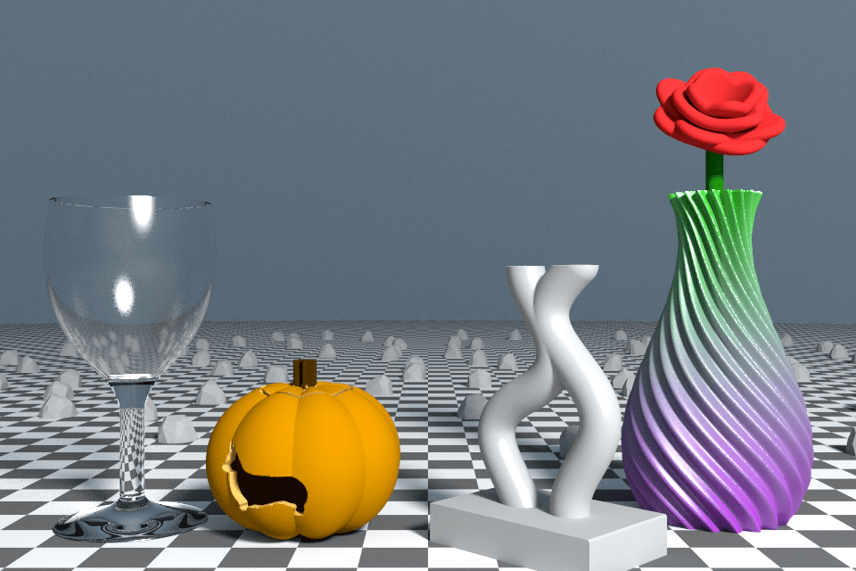

# model3d [](https://godoc.org/github.com/unixpickle/model3d)

This is a collection of tools for programmatically creating, manipulating, and rendering 3D models.

The following image was created completely from models made with `model3d`, rendered with the `render3d` sub-package of `model3d`:



See the [showcase example](examples/renderings/showcase) for details on how that image was created, and which models it uses (all of which are included in the [examples](examples) directory).

# Examples

If you are eager to get started, you may jump right into the [examples](examples) directory. Most of these examples produce models which can be 3D printed, although a few are more focused on cool-looking renderings.

Here's a few examples you may want to check out first:

 * [vase](examples/decoration/vase) - a 3D-printable vase. This example gives a really simple picture of how to create a custom `model3d.Solid` implementation and turn it into a mesh.
 * [heart_box](examples/romantic/heart_box) - a 3D-printable heart-shaped box. This example incorporates a 2D image (a heart) into a 3D design using the `model2d` sub-package. It gives an overview of how to inset (i.e. shrink) shapes, and how to build 3D solids out of them.
 * [table](examples/usable/table) - a multi-part 3D printable bedside table. This example shows how to compose simple solids into more complex solids. It also shows how to use the `toolbox3d` sub-package to print parts with built-in screws and screw-holes.
 * [cornell_box](examples/renderings/cornell_box) - a classic ray tracing demo. This example shows how to construct 3D scenes and objects and render them with the `render3d` sub-package.

# Creating models as Solids

There are four ways to represent objects in `model3d`. These are `Solid`, `Collider`, `Mesh`, and `SDF`. The GoDoc has more information on these representations, so let's focus on the `Solid`.

A `Solid` represents an object as a boolean function, where the function returns `true` for points inside the object. In particular, a `Solid` is a simple interface:

```go
type Solid interface {
	Min() Coord3D
	Max() Coord3D
	Contains(p Coord3D) bool
}
```

Due to their simple and flexible representation, `Solid`s are easy to implement, compose, and derive from other shapes. The `model3d` package includes several APIs for composing solids, such as `JoinedSolid` and `SubtractedSolid`. It also includes several pre-built solids, such as `Sphere`, `Cylinder`, and `Rect`.

Once you have a `Solid` that you want to render or print, you can convert it into a triangle mesh using marching cubes. Here's an example of creating a sphere 3D model out of a `Solid`:

```go
solid := &model3d.Sphere{Radius: 1.0}
mesh := model3d.MarchingCubesSearch(solid, 0.01, 8)
mesh.SaveGroupedSTL("output.stl")
```

The resulting `.stl` file `output.stl` can be loaded into external applications, sent to a 3D printer, etc.

# Rendering models

The `render3d` sub-package provides a variety of ways to render a 3D model. For the easiest API, use `render3d.SaveRandomGrid`, which renders a model from a variety of random angles (but assuming the z-axis is the axis of gravity), and saves the renderings to a file. It can take `*model3d.Mesh`, `model3d.Collider`, and `render3d.Object` arguments, and automatically adds colors/textures if needed.

Here's an example when using this API to render a dog-bone-shaped box:


That rendering was created with this one line of code:

```go
render3d.SaveRandomGrid("rendering_box.png", mesh, 3, 3, 300, nil)
```
