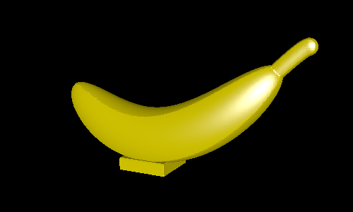

# banana

This example creates a banana shape on a small base. It demonstrates using bezier curves and 2D cross-sections to create a 3D shape. The model is intended to be printed (with supports) and stuck to a wall as decoration.

# Defining the banana

The 2D cross-section of the banana is created by intersecting four circles. This looks like this:

Next, the cross section is extended along a curve defining the length-wise shape of the banana. This defines the general arch that brings the middle of the banana down.

Finally, a separate function determines the radius along the length of the banana, which is smooth except for the stem which is constant radius. This makes the tips of the banana thinner than the middle.

# Renderings

