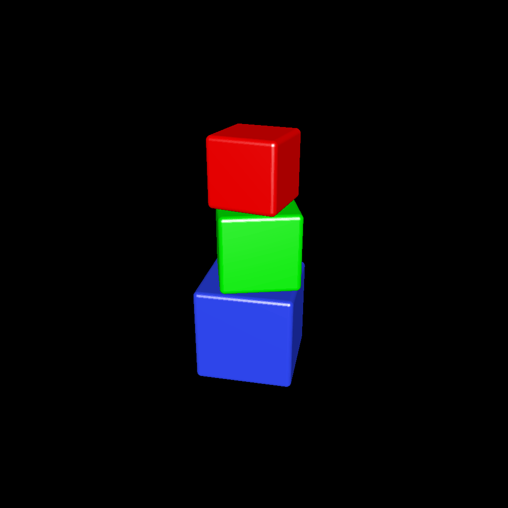

# cube_stack

Create a stack of three colored cubes with rounded edges. This model is intended to be printed with Binder Jetting. As part of this design, only the bottom cube is filled in, while the others are hollow. A hole runs through the cubes out the bottom of the model to allow excess material to be removed from the top two cubes after printing.

# Rendering

