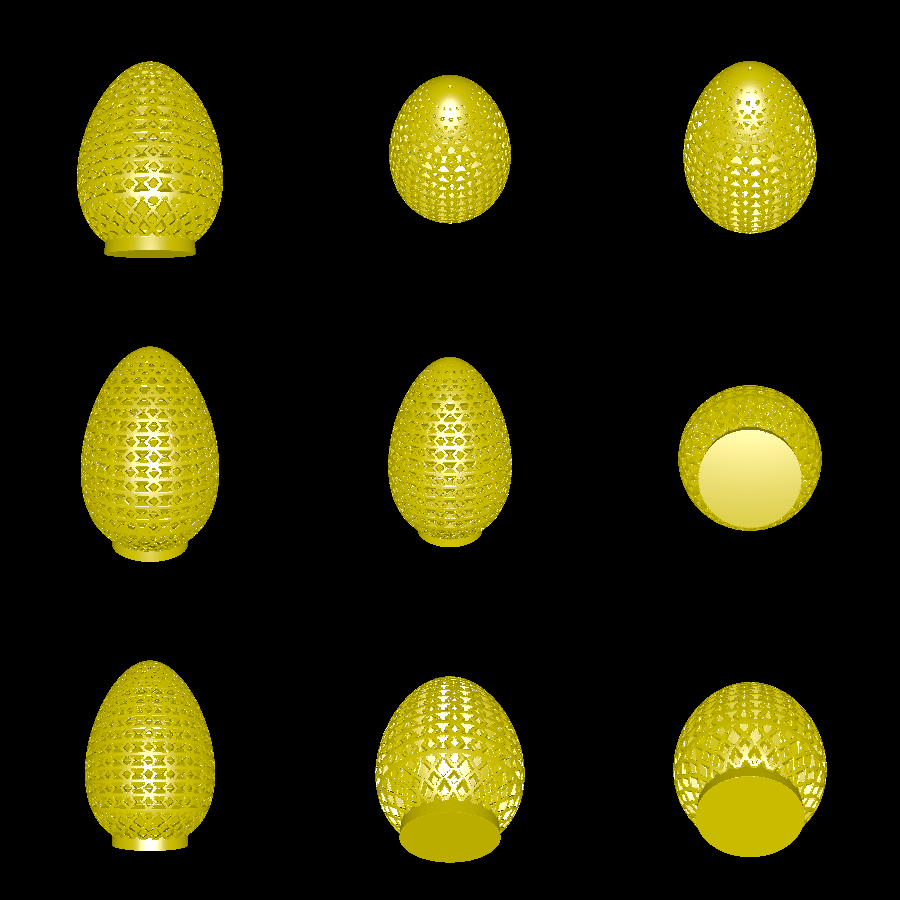

# zigzag_egg

This example composes a number of 2D and 3D shapes to produce an egg-like solid with a zig-zag pattern on its surface.

# How it works

First, an egg shape is created from a bezier curve. A smaller egg is also created, and a zig zag is generated between the smaller and larger egg:

To create the zig-zag going side to side up the egg, a zig-zaggy plane is created and rotated around the Z axis many times. The union of these two patterns, intersected with an egg shape (and a cylindrical base) look like this:

