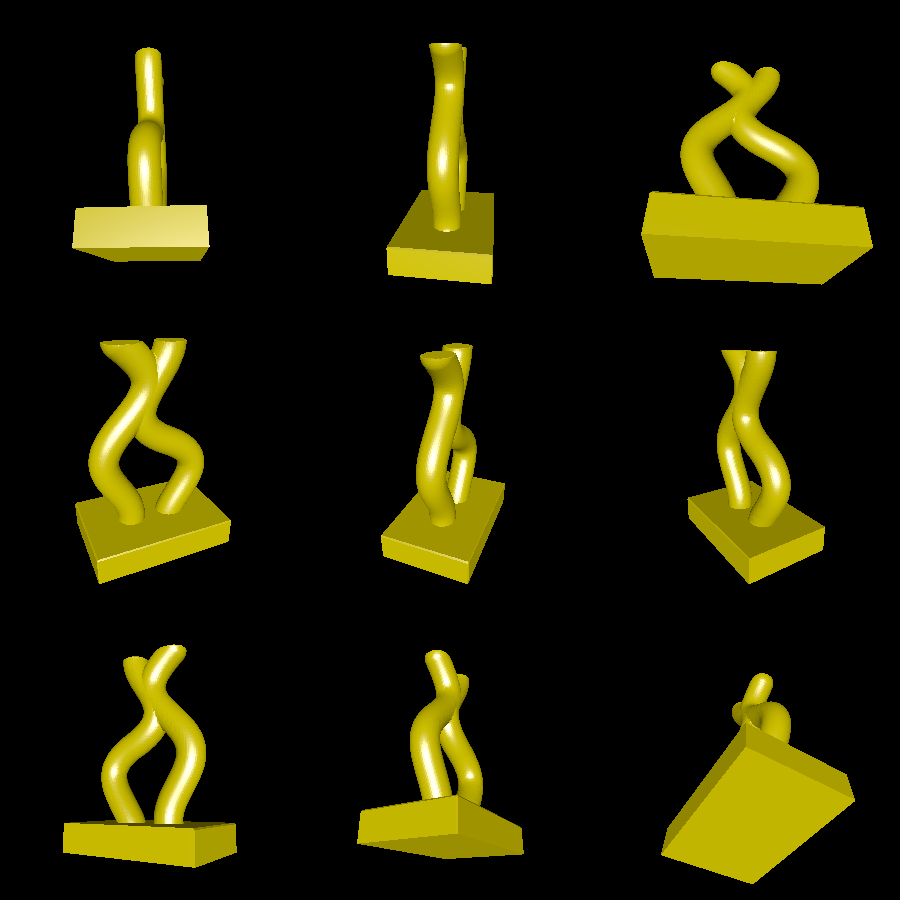

# curvy-thing

This example creates an abstract art piece by creating tubes around two algebraically-defined curves. First, the curves are approximated as 2D segments (an unclosed `model2d.Mesh`). Then, these line drawings are "thickened" using a `model2d.Collider`.

# Renderings

