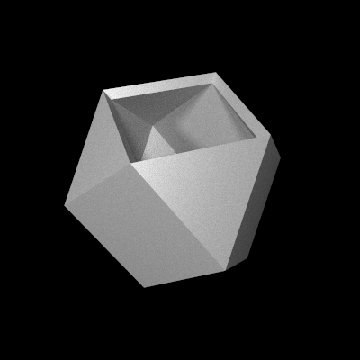

# cut-cube

This demo creates a decorative container that is generated by cutting the corners off of a cube, and then cutting a hole in the top.

# Rendering

Here is a high-quality ray-traced rendering of the finished 3D model:

