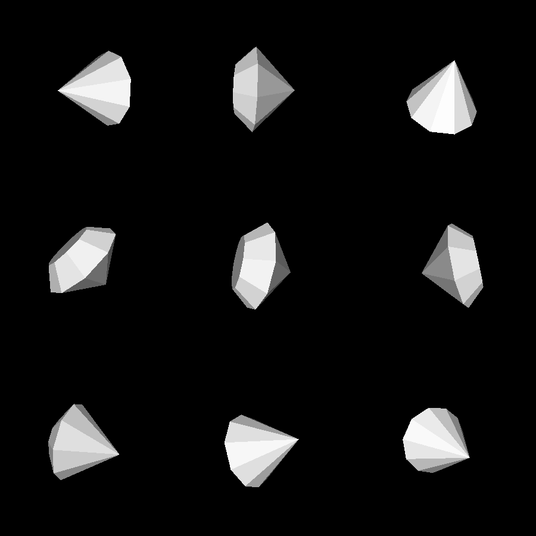
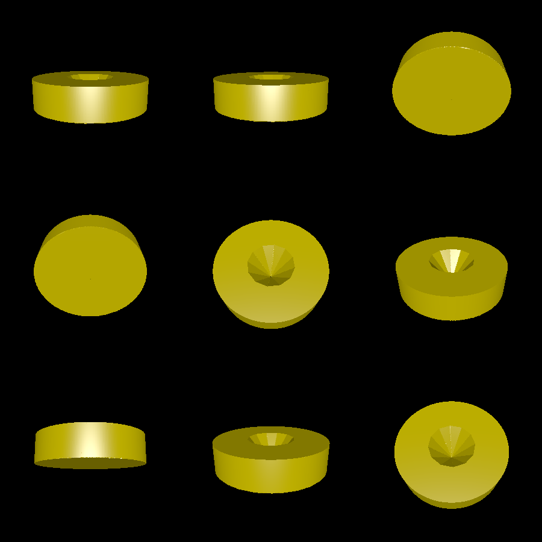

# diamond

This example showcases the convex polytope API. In particular, a diamond shape is created as a system of linear inequalities, and then this system is turned into a mesh.

As icing on the cake, we can turn the polytope into a Solid and cut it out of a circular stand. This stand must then be turned into a mesh with marching cubes, since it's not a convex polytope itself.

# Renderings

Here is the diamond:

Here is the stand:

