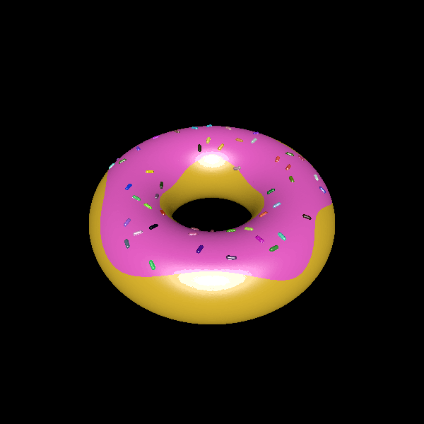

# donut

This example creates a simplistic, multi-color 3D model that looks like a donut. The icing is created using an orthographic projection of a simple polar function, and the sprinkles are quasi-randomly laid out normal to the donut within the icing region.

# Rendering

Here is a rendering of the donut in color. It can also be printed in color, as it is exported in a multi-color format.

