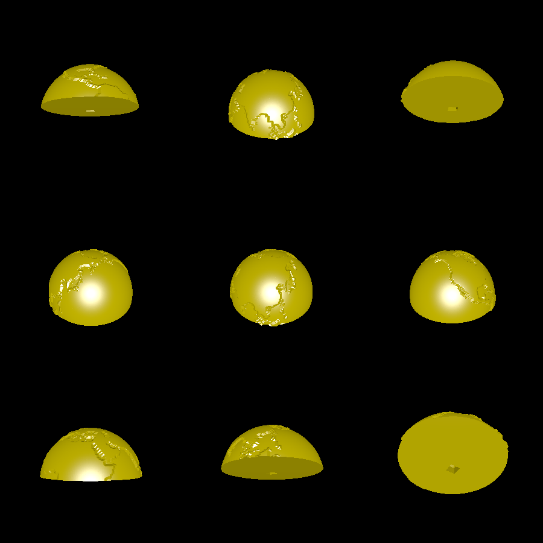
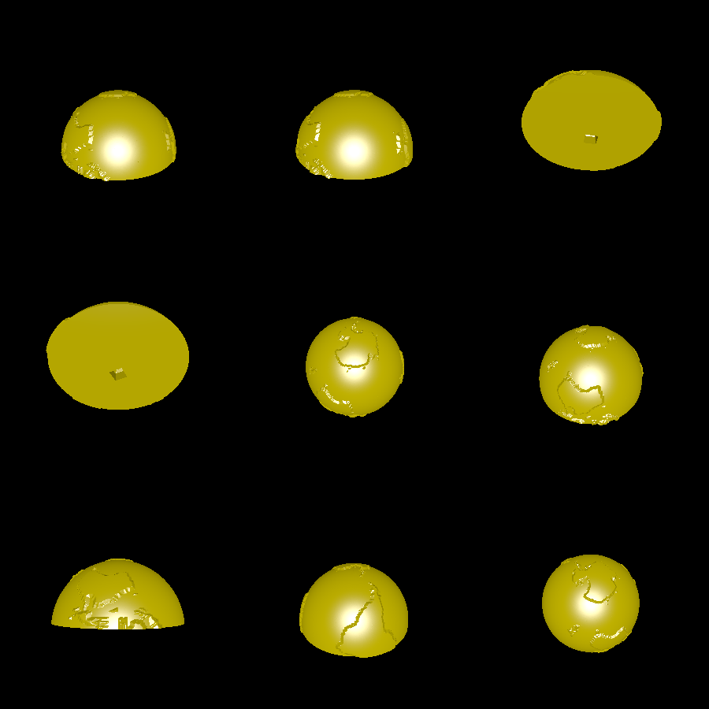

# globe

This example creates an FDM printable globe. It can be printed without supports because:

 * It is split into two halves
 * The continents jut out at 45 degrees or less, so no support is needed for them.

# Renderings

Here is the top:

Here is the bottom:

