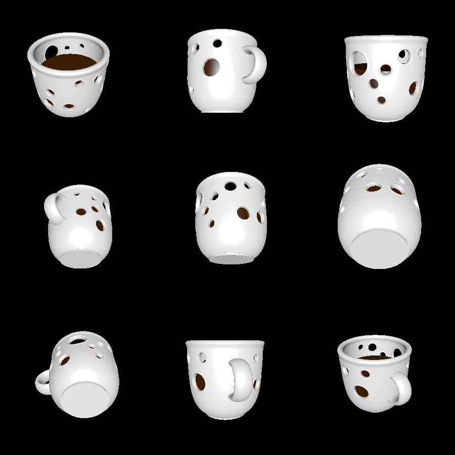

# impossible_mug

Inspired by [this tweet](https://twitter.com/irinablok/status/1538573230184665093), I am creating an "impossible coffee mug" to have 3D printed. This mug has fake "coffee" inside of it, and is filled with holes.

# Rendering

