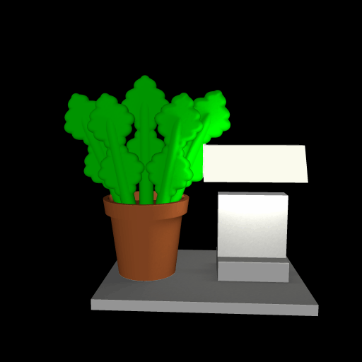

# lamp

This is a pair of optical illusions. First, a lamp shade appears to be floating above a lamp stand, but is actually attached to a neighboring plant. Second, the scene appears to be lit by the lamp using ray casting, so it can be printed in color and give the illusion that the lamp is actually casting light.

# Rendering

