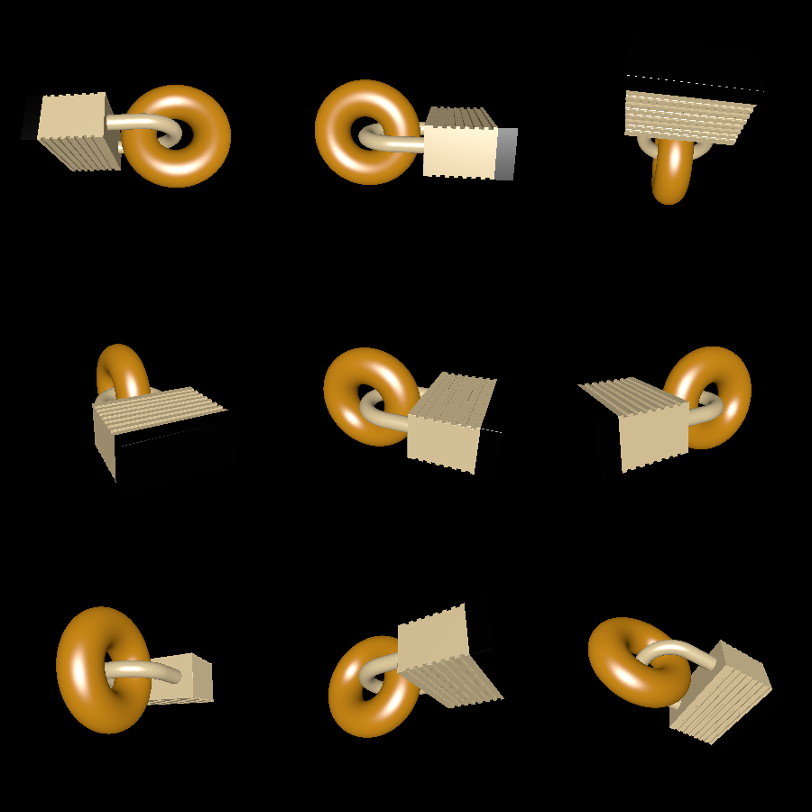

# lockbagel

This is the first 3D model I designed with the Solid API. It shows how to create a non-trivial shape (a lock). It also demonstrates that you can 3D print interlocking shapes (a lock and a bagel).

# Pictures

Here's a picture of a real-life 3D print of the model created by this example:

Here's a computer rendering:

