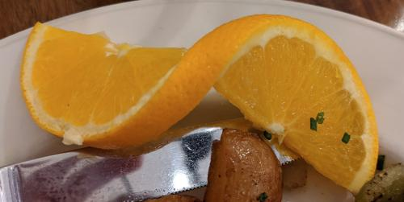
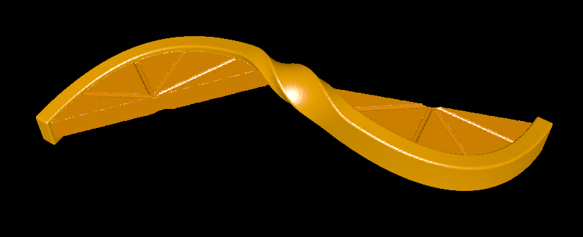

# orange_slices

The other day at a hotel, I was served two orange slices connected in a mind-bending fashion:

I attempted to recreate these orange slices as a 3D model. The result, seen below, is definitely far from perfect. There's still something that illudes me about these orange wedges!

# How it works

The peel itself is defined by a series of 2D Bezier curves:

 * `PeelCurve()` - the 2D projection of the peel onto the plane. Defines the actual semicircle shapes and the cross-over.
 * `PeelHeight()` - the Z component of the peel. This gives a bit of a vertical bend to the peel, allowing it to rise slightly above the actual wedges.
 * `PeelTwist()` - a Bezier curve mapping x coordinates on `PeelCurve()` to angles of twist. This is mostly constant at zero and pi, and interpolates between the two near the middle of the peel.

With all of those curves, we can construct the peel in many ways. In my opinion, the easiest way is to trace along the peel curve and triangulate it as we go. This is a bit indirect, since I turn this triangle mesh back into a `Solid` to combine it with the wedges.

The wedges themselves are quite simple. I basically trace the inside of the peel on both sides (one side per wedge), and connect the endpoints to make the straight edge of the wedges. I then trace a few lines from the center of each wedge's straight edge to the peel, creating the divots in the wedges to simulate an orange slice.

# Rendering

