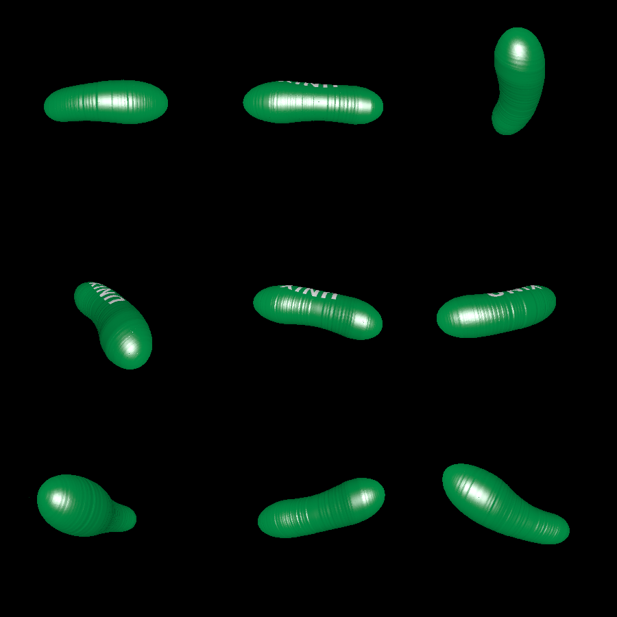
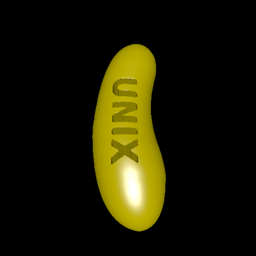

# pickle

This is a demo of creating a solid of revolution based on an outline. It leverages a `model2d.Collider` to slice the outline at each y value.

The demo also overlays the orthographic projection of an inscription over the solid of revolution. This inscription can either be put into a different color, or can be etched out of the solid altogether.

I had a small version of the etched model printed in metal. It makes a great piece for the Monopoly board game!

# Renderings

Here's the color version:

Here's the etched version:

