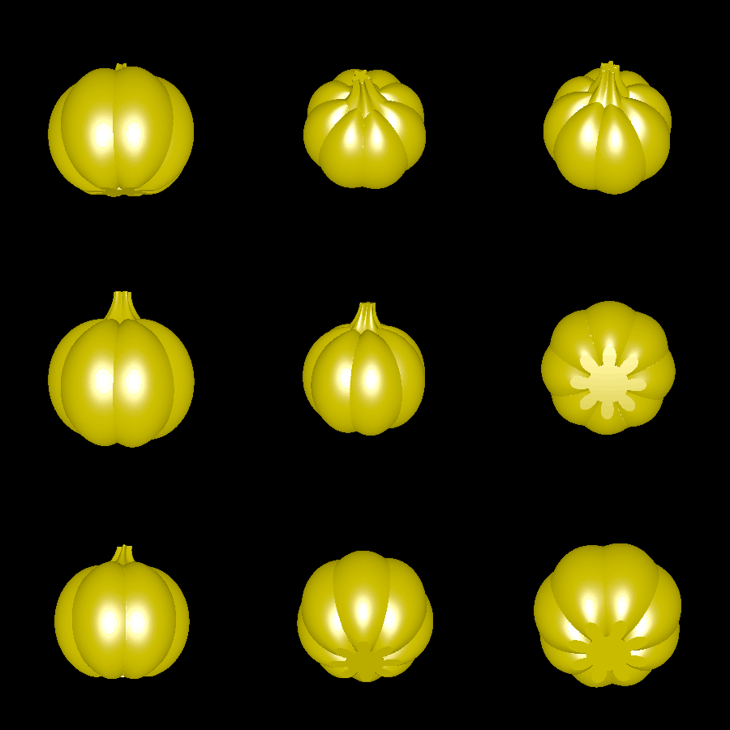

# pumpkin_v2

This example creates a simple pumpkin 3D model for 3D printing and then painting/decorating as you please.

The base of the pumpkin is flattened out to make it easier to achieve good bed adhesion and reduce the amount of required support.

# Renderings

