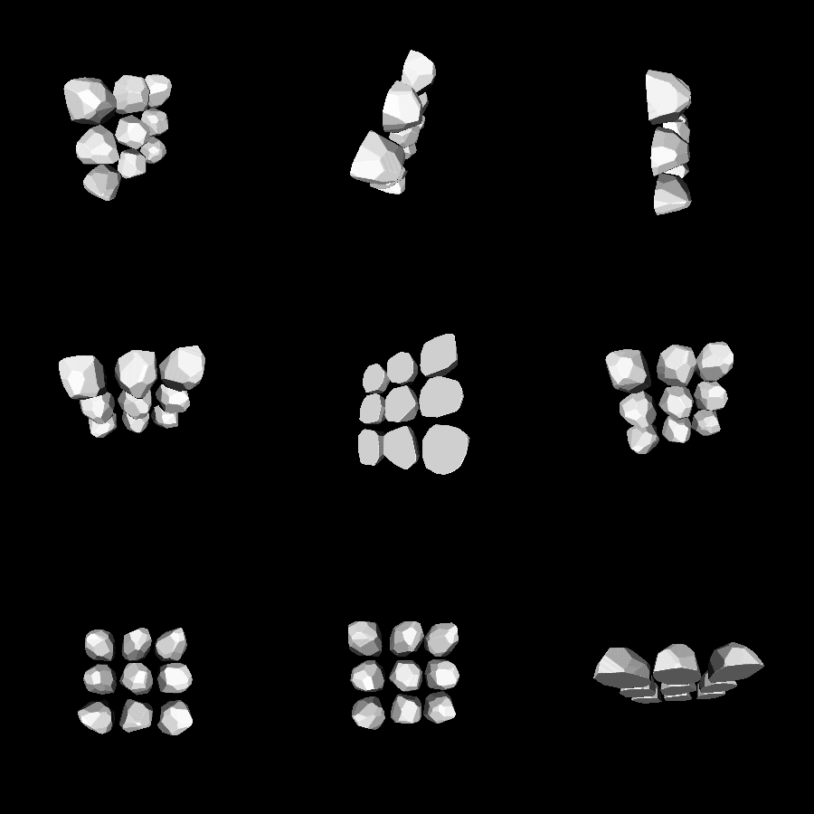

# rock

This example creates rock-like objects using the `model3d.ConvexPolytope` API. A convex polytope is a system of linear inequalities, i.e. the space contained within a set of planes. It is easy to triangulate such systems (at least, when they are small). It is also easy to generate cool-looking randomized convex polytopes, as this example shows.

# Rendering

