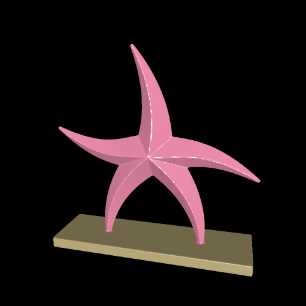

# starfish

This example creates a starfish with five arms.

Each arm is represented as a Bezier curve eminating from the origin. At the origin, the thickness of each arm is at its maximum, and it linearly decreases throughout the length of the arm until a minimum value at the end of the Bezier curve. We then turn this 2D structure into a 3D structure.

Given a 3D point `c`, we project it onto the xy plane (`p`) and then further project this point onto the Bezier curve (`p1`). The thickness for `p1` is then calculated. For `c` to be in the solid, `abs(||p-p1||) + abs(c.z)` must be less than the thickness. This produces a triangular shape, while still maintaining smoothness along Z cross-sections. Projections and thickness calculations are performed on a discretized version of the Bezier curves, for ease of computation.

# Rendering

