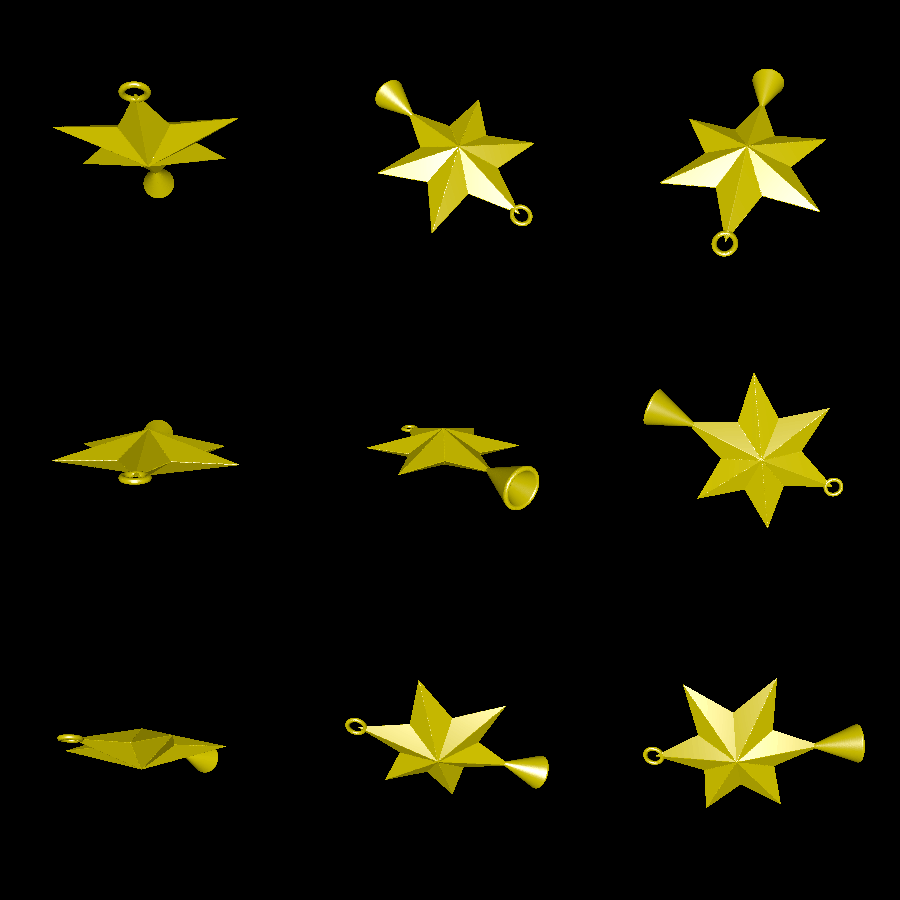
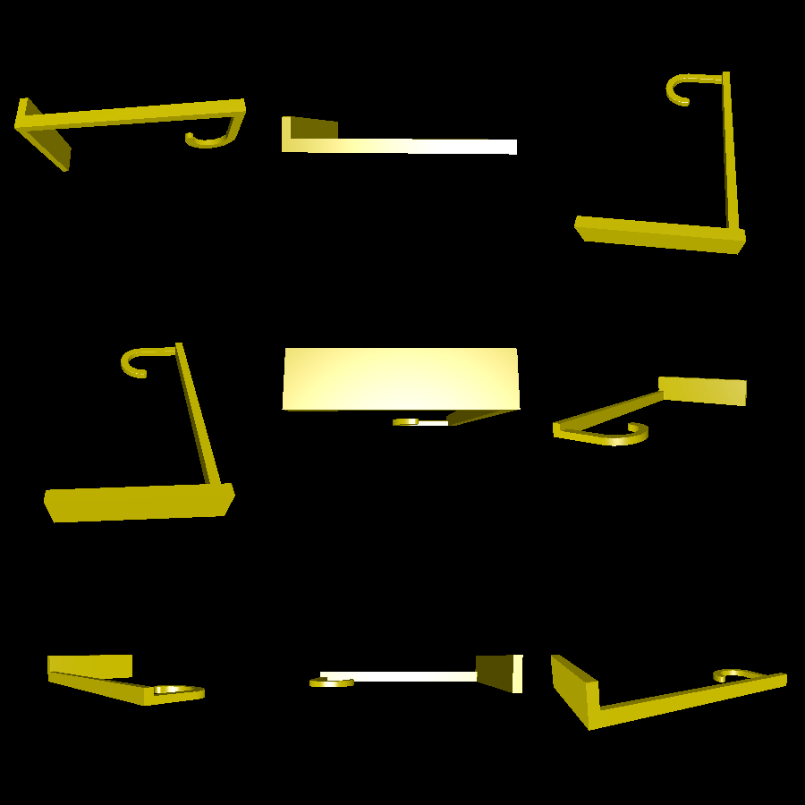

# tree_ornament

This is a 3D-printable topper or ornament for a [Christmas tree](https://en.wikipedia.org/wiki/Christmas_tree). It is a six-pointed star (i.e. a [Star of David](https://en.wikipedia.org/wiki/Star_of_David)), in order to mix the two traditions.

The star includes a small cone on the bottom of it to help it stay on a tree. However, if it does not rest soundfully on the tree, this demo also includes a 3D-printable hook to mount to a wall or a nearby surface and use to hang the star.

# Renderings

Here is a rendering of the star decoration itself:

Here is the wall-mountable hanger that you may choose to use if the star does not balance on the tree:

