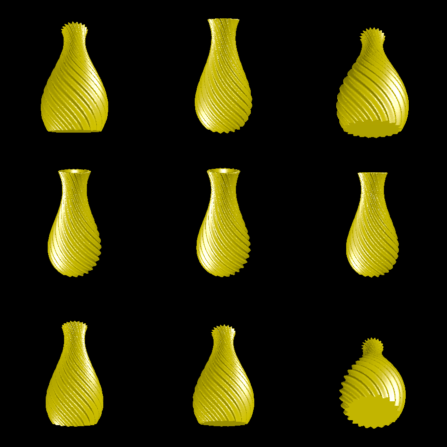

# vase

This cylindrical-coordinate vase is conceptually simple, but very nice looking. The radius is defined by a high-frequency function radially, combined with a low-frequency curve going up the z-axis.

The vase can be printed support-free with FDM, and it really does hold water!

# Renderings

