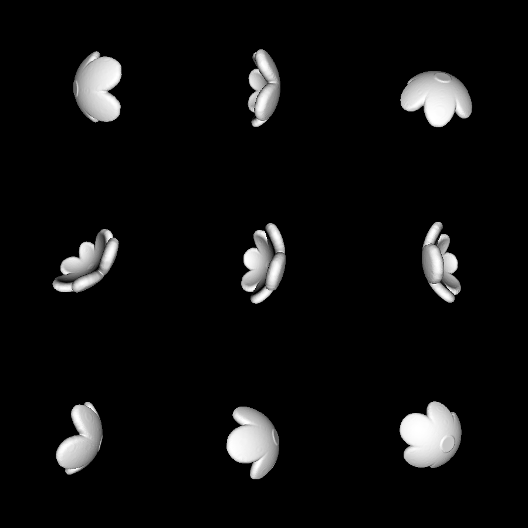

# wall-flower

This is a flower decoration that you can print out in batches and attach to your walls.

# How it works

The model is generated by first constructing the six-pedal flower in 2D polar coordinates. This looks like this:

To turn this 2D shape into a 3D object, it is projected onto the bottom of a sphere, causing it to be rounded with the pedals sticking up. Finally, this flat shape is made thick by extending it 0.1 inches in every direction.

In other words, to tell if a point `C` is within the flower, it is first projected onto the sphere, and then further projected onto the flower shape that was projected onto the sphere. This gives a point `P`. If `||C - P|| < 0.1`, then C is within the flower.

# Renderings

