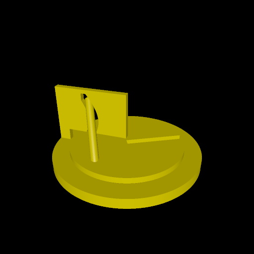

# disc_with_cutout

This is a reproduction of an optical illusion that I recently saw. A disk with a seemingly straight pole coming out of it can be rotated, and pass through a curved slit that visually looks like it should collide with the pole.

This program produces two meshes: one for the disc, and one for the board (with the "barrier/obstacle" attached to it). The disc can slide into place on the board (thanks to the slit), and hash a groove which matches a groove in the board.

# Rendering

Here are two different rotations of this illusion:

