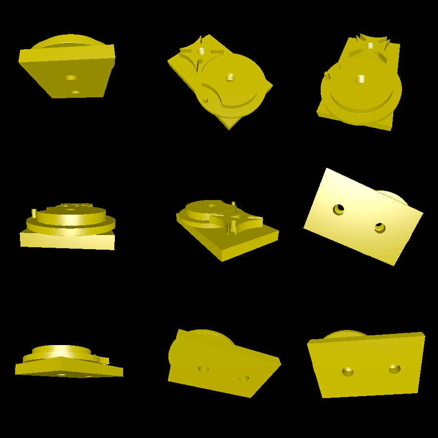

# geneva-drive

This experiment creates a working, printable [Geneva drive](https://en.wikipedia.org/wiki/Geneva_drive). The Geneva drive is constructed by printing two gears (a drive and a driven gear), a board, and two screws. The screws attach the gears to the board, while allowing the gears to spin around freely.

I actually printed this design, and it works very well!

# Rendering

The resulting model (minus the screws) looks like this:

During the debugging stage, I also created a rendering of the gear profiles:

