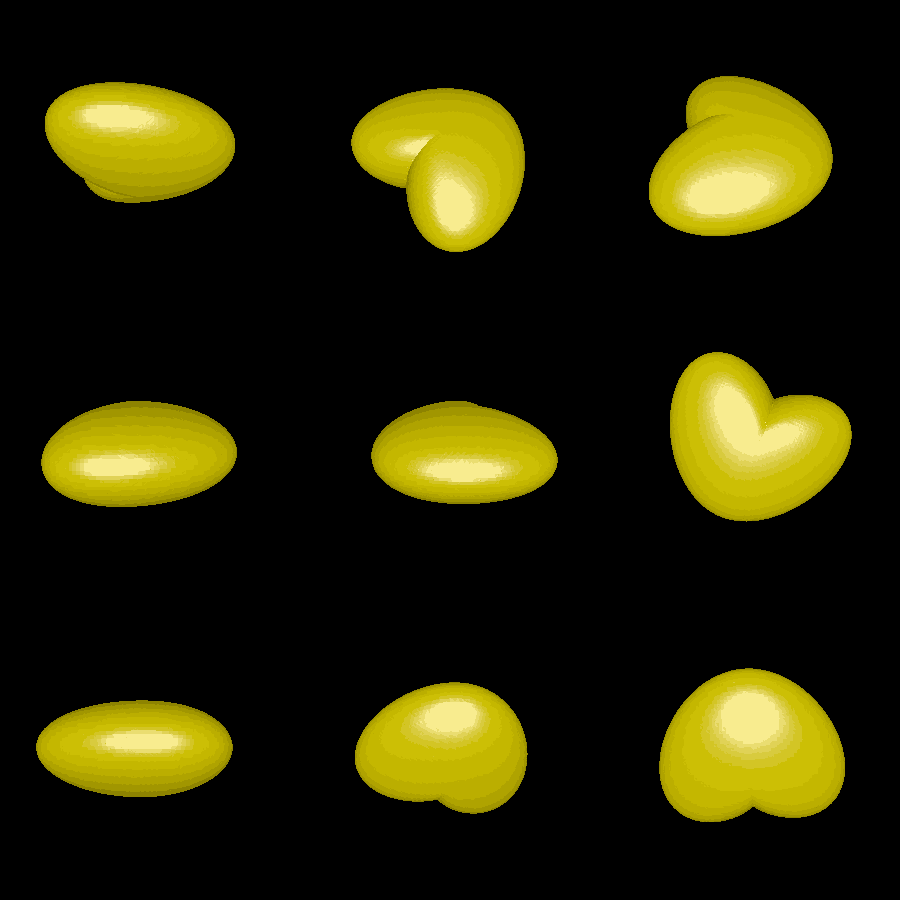

# pillow-ellipses

This is an experiment to generate rounded 3D shapes from 2D shapes. For this method, we first select a center point in the 2D shape and convert the shape to polar coordinates (theta, r(theta)). To extend this shape on the xy plane into the z axis, we create ellipses eminating from the center, with central axis given by `z` and `(cos(theta), sin(theta))`. We use a constant radius along the z axis and `r(theta)` along the other axis. In the case of the original 2D shape being a circle, this method can produce a sphere (possibly squished or stretched along the `z` axis depending on our choice of radius there).

The goal of this experiment is similar to [pillow_medial](../pillow_medial) and [pillow_sphere](../pillow_sphere). However, this particular method is less general since it requires the 2D shape to be a function in polar coordinates. I was hoping that the freedom to choose a center point would make this method a bit more tailorable to the specific 3D heart example I was interested in.

# Renderings

Here is what happens when you apply the algorithm to a heart shape:

