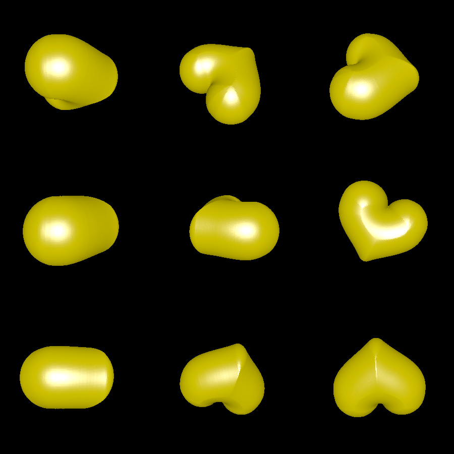

# pillow-sphere

This is an experiment to generate rounded 3D shapes from 2D shapes by insetting their SDF according to the radius of a sphere. The goal is similar to [pillow_medial](../pillow_medial), but the results do not look nearly as compelling. Also see [pillow_sphere](../pillow_sphere). The main difference from `pillow_sphere` is that we instead use the maximum of the SDF instead of 1, potentially preventing odd behavior for asymmetrical shapes.

# Renderings

Here is what happens when you apply the algorithm to a heart shape:

