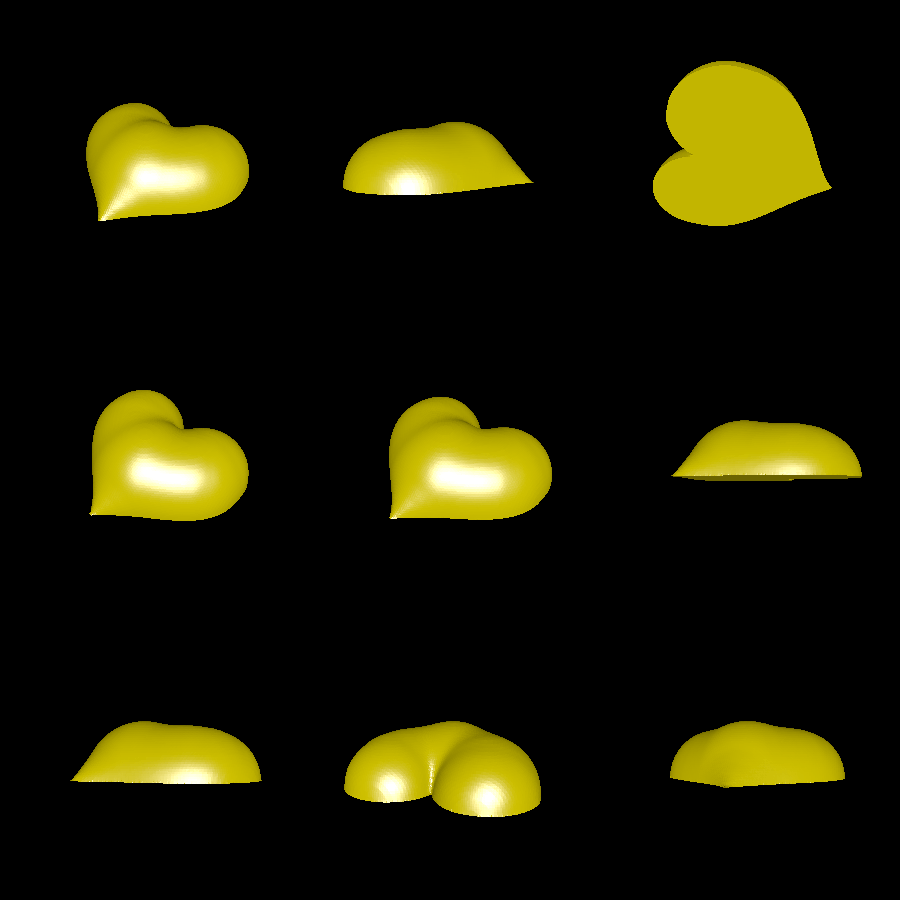

# pillow-2d-shape

This is an experiment to generate rounded 3D shapes from 2D shapes.

This rounding algorithm is inspired by the fact that 2D shapes have natural extensions into 3D. For example, a circle naturally becomes a sphere, a square becomes a pillow-like shape, a heart becomes a rounded and smooth heart-like object, etc.

To extend the above observation to arbitrary shapes, we fill the 2D solid with circles, and then turn those circles into spheres.

# Renderings

Here is what happens when you apply the algorithm to a heart shape:

