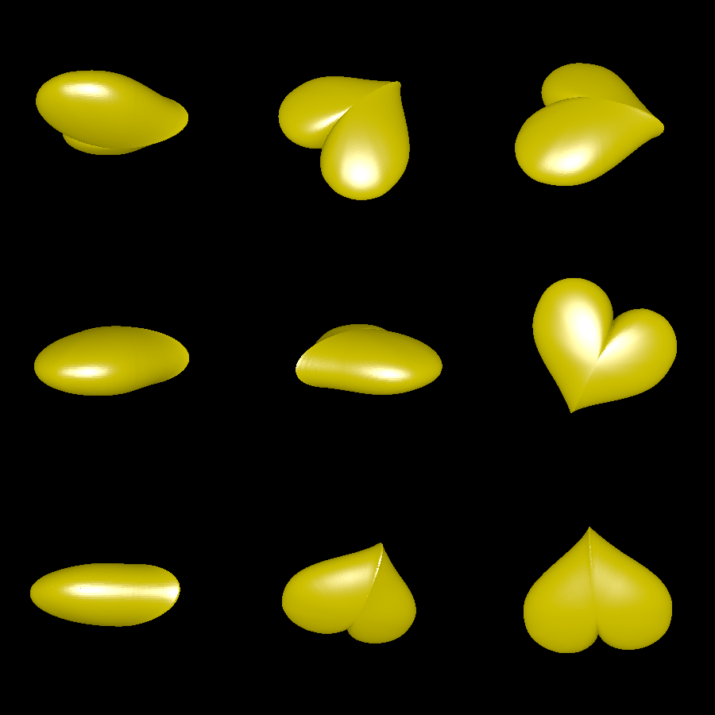

# pillow-sphere

This is an experiment to generate rounded 3D shapes from 2D shapes by shrinking them according to the radius of a sphere. The goal is similar to [pillow_2d_shape](../pillow_2d_shape), but the results do not look nearly as compelling.

# Renderings

Here is what happens when you apply the algorithm to a heart shape:

