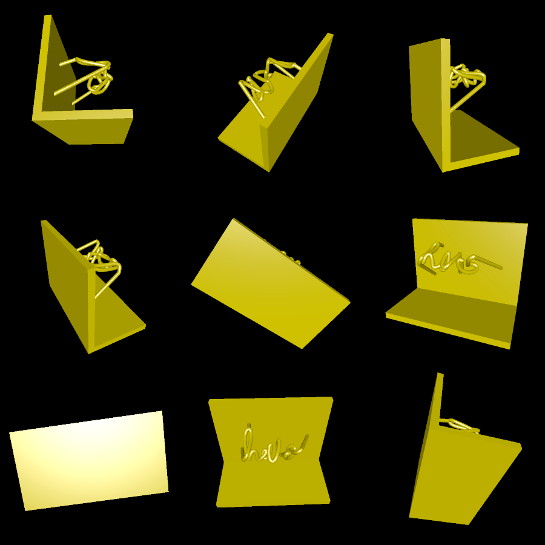

# shadow_text

Create a 3D shape whose shadow is a pre-specified 2D path.

You can create a new path using [draw_path.html](draw_path.html). Extract the JSON and gzip it, then specify `-path path/to/file.json.gz`.

# Renderings

Here's the model from the light's point of view

Here's the model from random points of view:

