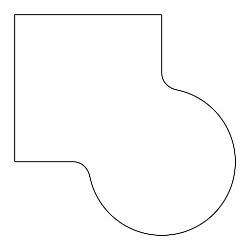
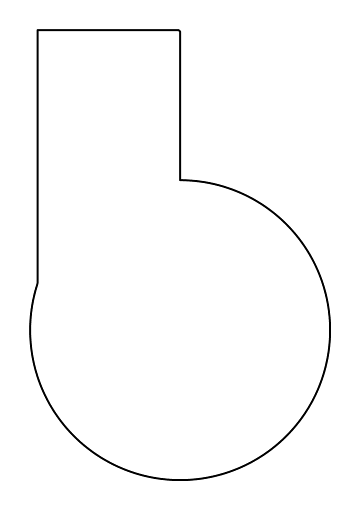
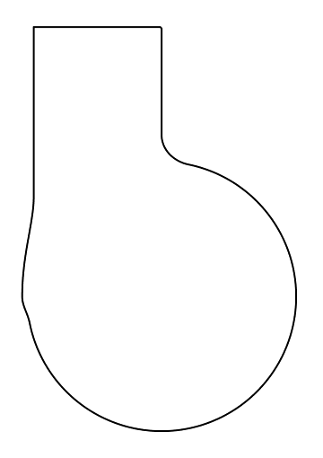
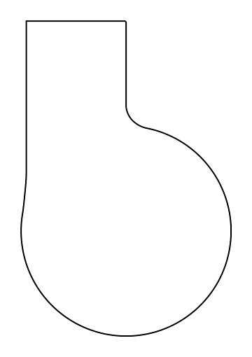

# smooth_join_2d

This is a set of experiments for computing smooth unions of SDFs. I test both `SmoothJoin()` and `SmoothJoinV2()`, and show that the latter works better than the conventional algorithm used by the former.

Originally, I had implemented `SmoothJoin()` using the algorithm described in [this blog post](https://www.ronja-tutorials.com/post/035-2d-sdf-combination/) which is prevalent throughout the SDF literature. This algorithm *appears* to work for well-behaved examples, but has some rough edges.

For example, using the classic smooth SDF union algorithm, we can combine a square and a circle smoothly like so:

. This works well because the square intersects the circle at nearly right angles. What happens if we shrink the square along one dimension to make it intersect the circle at an obtuse angle, like so?

In this case, the above algorithm breaks down and produces a weird "lump":

The issue is that this algorithm doesn't take into account the normals of the two SDFs at the intersection point, so it doesn't work when two SDFs are nearly parallel at the intersection. In the most degenerate case, we could apply the smooth join algorithm to take the union of a shape and itself, which would end up producing a slightly expanded version of the original shape (whereas it should simply be a no-op).

My `SmoothJoinV2()` method takes normals of SDFs into account. This allows us to do the same smoothing algorithm that works well for right angles, while preventing weird lumps at obtuse angles:

