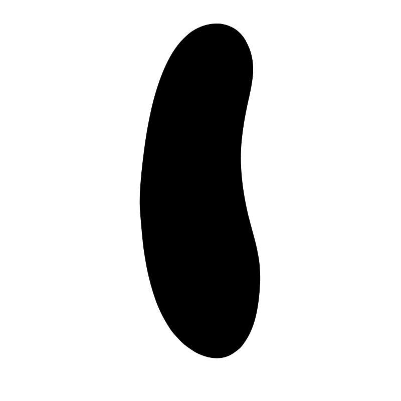

# smooth_shape

This program uses the `model2d` package to read a raster image of a shape, vectorize it, smooth it out, and save a higher-resolution version of the same image.

# Results

I've included a test image for reference. Run this command to reproduce this result:

```
$ go run . input.png output.png
``` to reproduce these results.

In this example, we take a blurry raster image like so:


and produce a much crisper image in 2x the original resolution:


