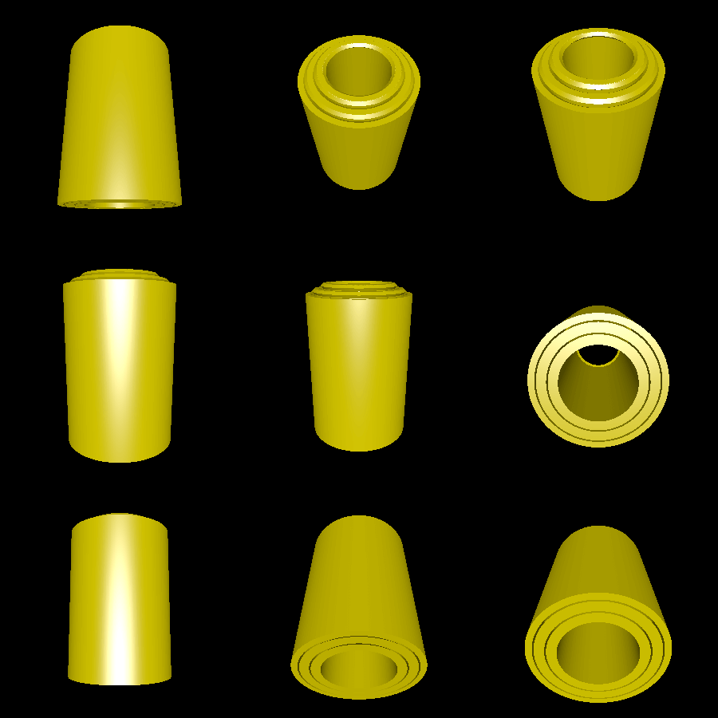

# telescoping

This is an attempt to make a series of interlocking telescoping tubes in a single print. In particular, this demo creates a model consisting of three interlocking tubes, which can be extended outward, but cannot be separated. See [Whip antenna](https://en.wikipedia.org/wiki/Whip_antenna).

To allow printing on an FDM printer, the notches in the tubes are triangular, extending at a 45 degree angle, to avoid the need for supports.

# Rendering

Here is a rendering of the first attempt:

