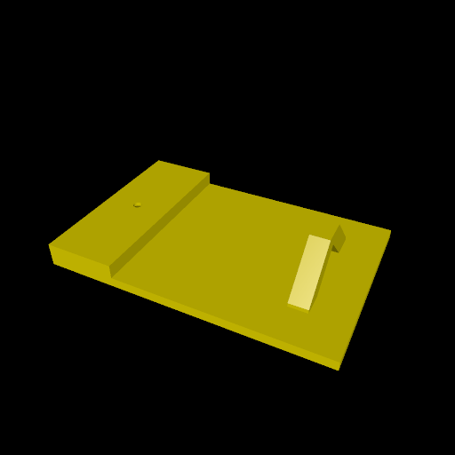
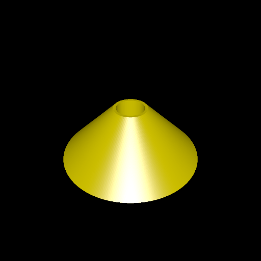
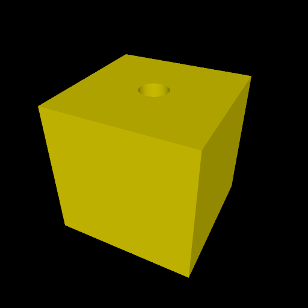
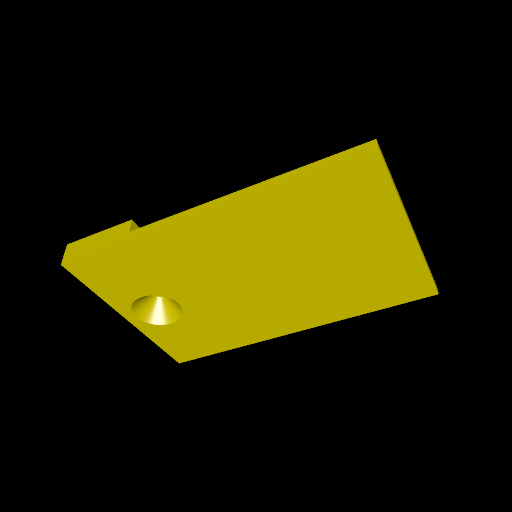

# topology_puzzle

In this example, we would like to demonstrate the topological fact that it is possible to tie a rope around a torus without passing either end of the rope through the torus itself. I find this hard to visualize in my head. It's much easier when you actually have a "rope" with large objects at either end that cannot fit through the torus.

To demonstrate this, we have a board with a closed loop at one end, and a string can protrude from the other end. This board looks like so, from the top:

You can thread a string through the hole on the left of the board. Then attach the string to two objects at either end by putting it through the holes and tying knots on the other side. Here is what the two end pieces look like:

Note the first end piece, which is a conic shape. This is intended to slide into the bottom of the board. As viewed from the bottom, the board has an indentation for this:

