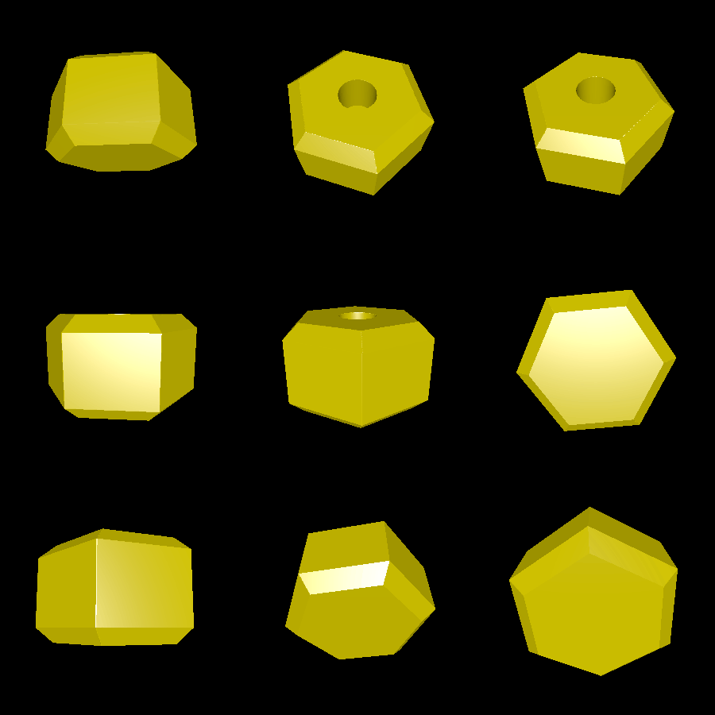
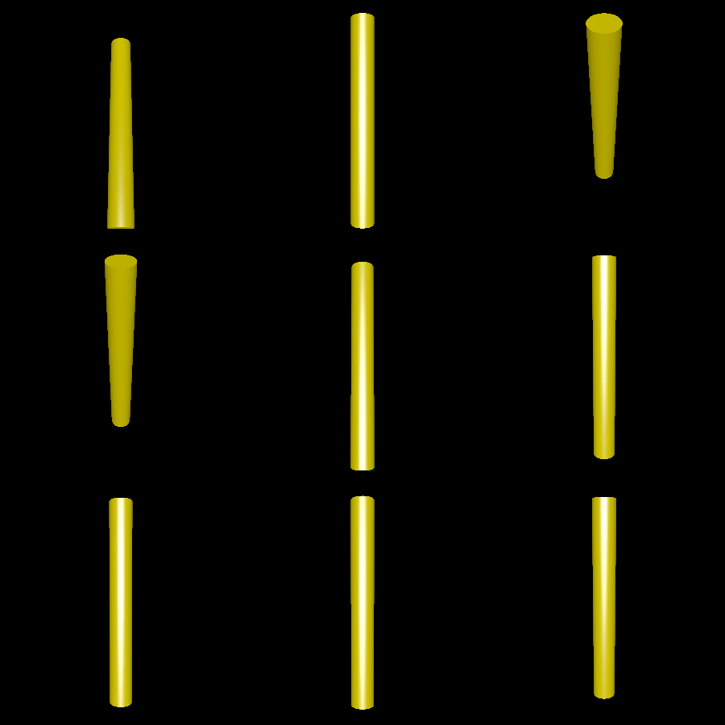

# dumbell

Ever wanted to fool someone into thinking you work out? Now you can! Just print this fake dumbell in dark filament, and people will never know you are lifting a hollow piece of plastic.

# Renderings

The primary model is two side-pieces that look like this:

Then you can print out a pole to stick into both sides and hold:

