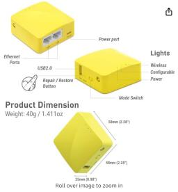
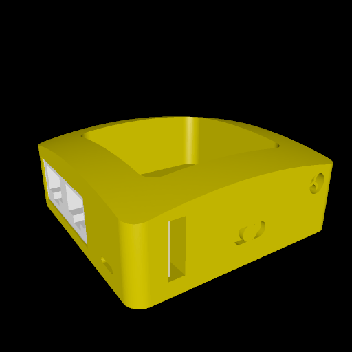

# gl_inet

This is a box with a lid that looks like a [GL.iNet Mango wireless router](https://www.amazon.com/GL-iNET-GL-MT300N-V2-Repeater-300Mbps-Performance/dp/B073TSK26W/ref=asc_df_B073TSK26W/). The real router looks like this:

# Rendering

Here is a rendering of the body of the model, not including the lid (which itself has three holes for "lights", but is otherwise quite plain):

