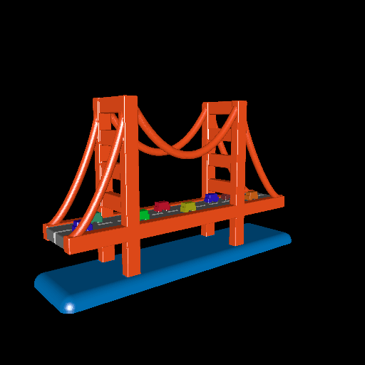

# golden_gate

This example creates a colorful 3D model that imitates the [Golden Gate Bridge](https://en.wikipedia.org/wiki/Golden_Gate_Bridge). The model is not realistic or to scale. Instead, it is intended to be printable with Binder Jetting or some other color 3D printing process.

# Rendering

