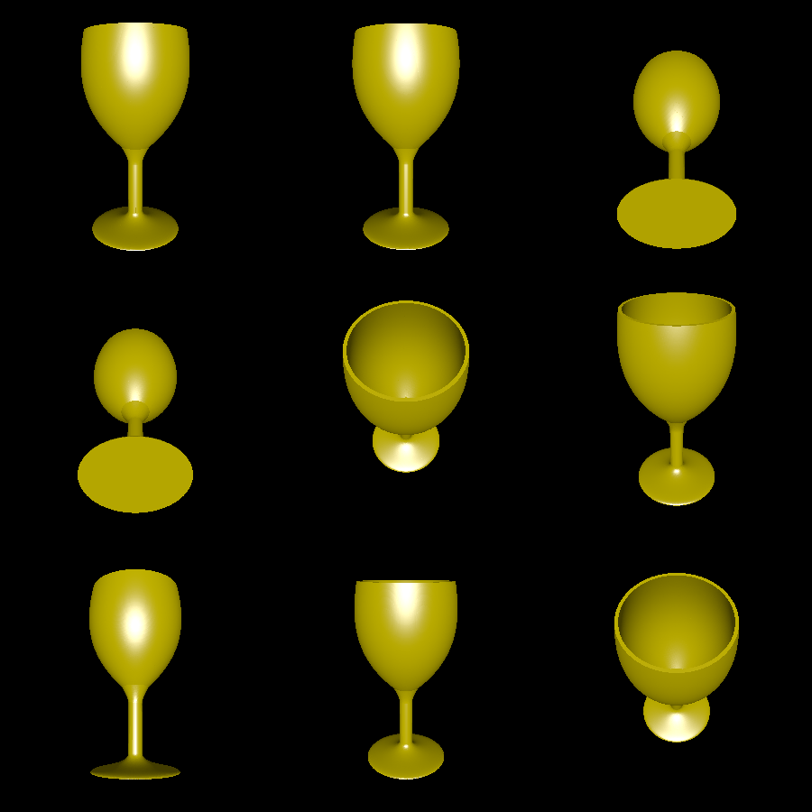
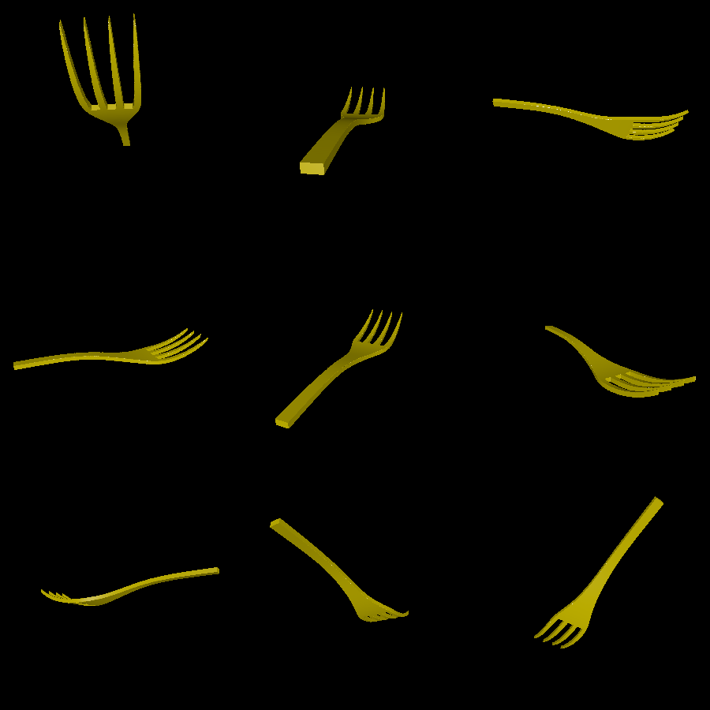

# place-setting

This is a work in progress parody of a dinner place setting.

It includes a wine glass generated with revolved Bezier curves. It also includes a fork 3D model with a shape derived from two Bezier curves.

# Renderings

Here is the wine glass:

Here is the fork:

