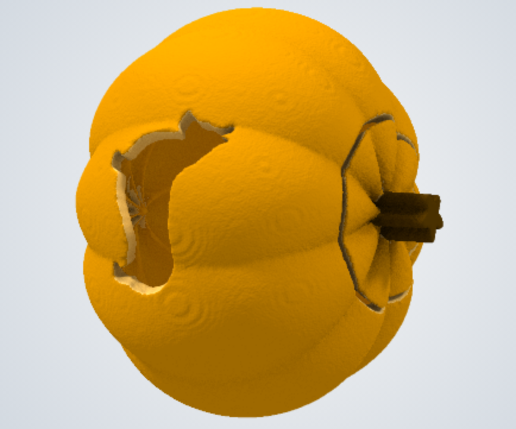

# pumpkin

This example shows how to create a [Jack-o'-lantern](https://en.wikipedia.org/wiki/Jack-o%27-lantern) with model3d solid primitives.

The resulting model is two pieces (a lid and a body), and looks like this:

