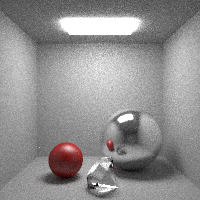
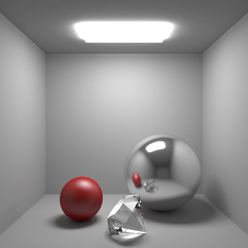

# cornell-box

This ray tracing example shows area lighting, reflection, refraction, and how to load existing 3D models (the diamond).

By default, it outputs a grainy low-resolution rendering (which takes about a minute):



Raising the quality and resolution is as simple as modifying these lines:

```go
MaxDepth:   5,
NumSamples: 400,
```

and this line:

```go
img := render3d.NewImage(200, 200)
```

Simply increase MaxDepth to maybe 15, increase NumSamples to 20000, and increase the resolution from 200x200 to whatever you want. Here's an example HD rendering at 500x500:


