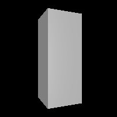

# deformation

This example uses the As-Rigid-As-Possible algorithm to animate a box being squeezed and twisted in various ways.

By default, this produces a small, low frame-rate rendering to save space in the repository. Constants at the top of the file allow for higher-resolution renderings:

```go
FrameSkip = 4
ImageSize = 200
```

Simply set `FrameSkip = 1` and `ImageSize = 500` for a smoother, nicer animation.

# Renderings

Here is the low-resolution animation as a GIF:


