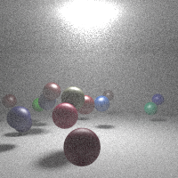

# fog

This ray tracing example shows how to use a participating medium to simulate fog. The fog itself is created with this code:

```go
&render3d.ParticipatingMedium{
    Collider: bounds,
    Material: &render3d.HGMaterial{
        G:            0.5,
        ScatterColor: render3d.NewColor(0.9),
    },
    Lambda: 0.01,
}
```

The fog fills a `model3d.Collider`, in this case a `model3d.Rect` encompassing the room. The material should always be an `HGMaterial`, since any other material won't know how to handle the randomized normals from a collision with the medium.

# Result

The resulting rendering is produced in a few minutes and looks like this:



It is a foggy room with a single light source and a bunch of colored spheres at random positions.

The quality could be increased by increasing the number of rays. In the example above, 1000 rays were used per pixel.
