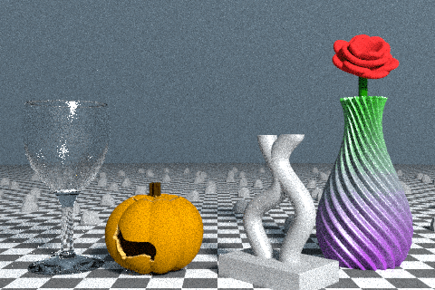

# showcase

This example renders a bunch of different 3D models created by various `model3d` examples. It is meant to produce a sort of "banner ad" for `model3d` as a whole.

Included are:

 * Wine glass - `examples/parody/place_setting`
 * Pumpkin - `examples/decoration/pumpkin`
 * Curvy thing - `examples/decoration/curvy_thing`
 * Vase - `examples/decoration/vase`
 * Rose - `examples/decoration/rose`
 * Rocks - `examples/decoration/rock`

The default output looks like this:

To export a higher-resolution version, set the `HighRes` flag at the top of `main.go` to `true`. Then you will get:

