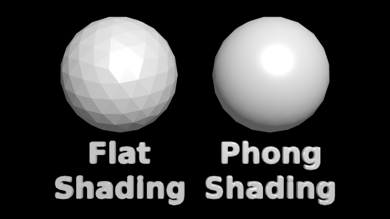

# smooth_shading

In this example, we create a low-polygon icosphere and render it with both smooth and flat shading. We also turn text labels "Flat Shading" and "Phong Shading" into 3D meshes, and render these below each sphere with the same shading method as the accompanying sphere.

Here is the final rendering:

As can be seen in this rendering, Phong shading hides the polygonal surface of the sphere except around the edges, where an outline of the original low-polygon icosphere is still clearly visible. This is because shading can only affect pixels that actually intersect the surface.
