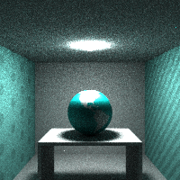
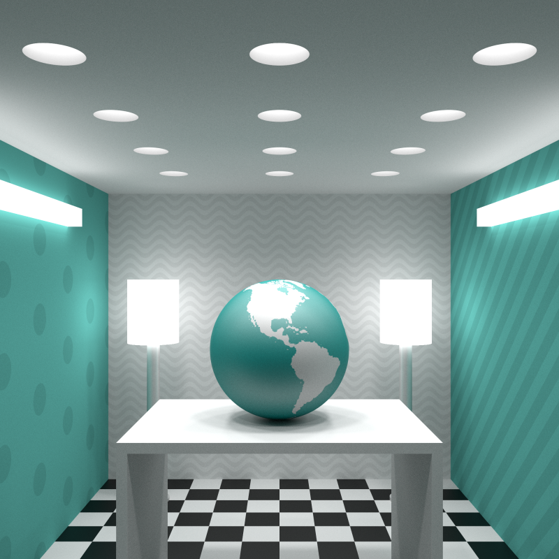

# tiffany

This rendering example creates textured objects with Tiffany Blue coloration. It uses [bidirectional path tracing](https://en.wikipedia.org/wiki/Path_tracing#Bidirectional_path_tracing) to greatly reduce variance (versus standard path tracing). It shows how one might render:

 * Inset ceiling lights
 * Area lights
 * Textures - both hard-coded and image-based

By default, this demo outputs a grainy, low-resolution rendering (which takes a minute or two):



Raising the quality and resolution is as simple as modifying these lines:

```go
NumSamples: 200,
MinSamples: 200,
```

and this line:

```go
img := render3d.NewImage(200, 200)
```

Simply increase `NumSamples` to maybe `100000`, increase MinSamples to `1000`, and increase the resolution from 200x200 to whatever you want. Here's an example HD rendering at 800x800:


