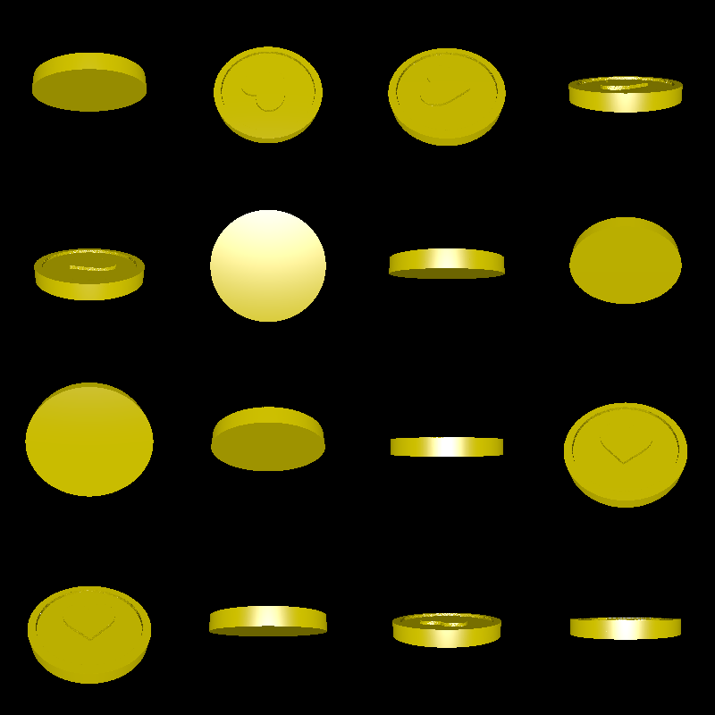

# coin

This tool creates one-sided coin models. The depth of the face of the coin is determined at each point by an image, where black represents a protruding part of the coin, and white represents a recessed part.

Here is a sample rendering:

