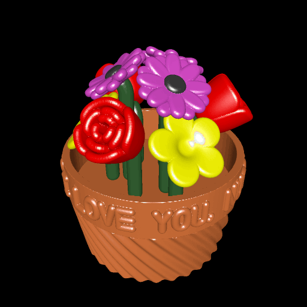

# floral_arrangement

This example uses `model3d` and `toolbox3d` to compose many different objects into a single colored object. It includes a vase (implemented as a single-color `model3d.Solid`), flowers (which are rotated and repeated multiple times), and flower stems (which are shaped and rotated accordingly for each type of flower). The different kinds of flowers tilt different amounts, and the stems bend accordingly to meet at a perfect perpendicular angle with each flower.

Each object, such as a flower or a stem, has a separate `toolbox3d.CoordColorFunc` defining the color of that object at every point. When an object is translated, we translate the color function as well. Finally, to combine all of the objects with a single color function, we use `toolbox3d.JoinedMeshCoordColorFunc`, which takes a mapping from meshes to color functions to switch between color functions for different points in space.

The vase includes a rim with text on it. The text is created using a custom (and incomplete) font implemented as a collection of Bezier curves for each letter.

# Rendering

