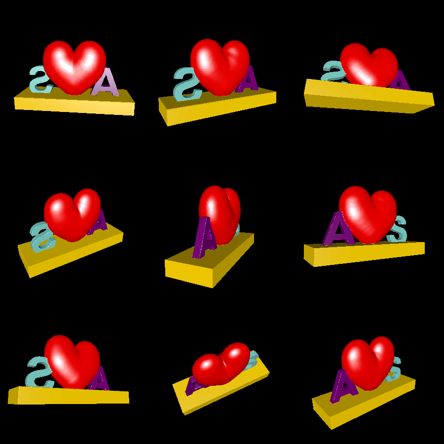

# heart-statue

This example generates a 3D heart by building spheres around the medial axis of a heart shape. It then places this heart upright on a rectangular stand, and embeds 3D letters into the stand on either side of the heart. It colorizes each letter, the stand, and the heart differently, producing a neat multi-color print.

The end result is meant to be 3D printed using a process that supports multiple colors.

# Rendering

Here are ideal renderings of the model:

