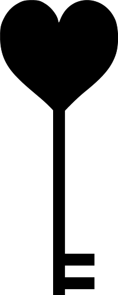
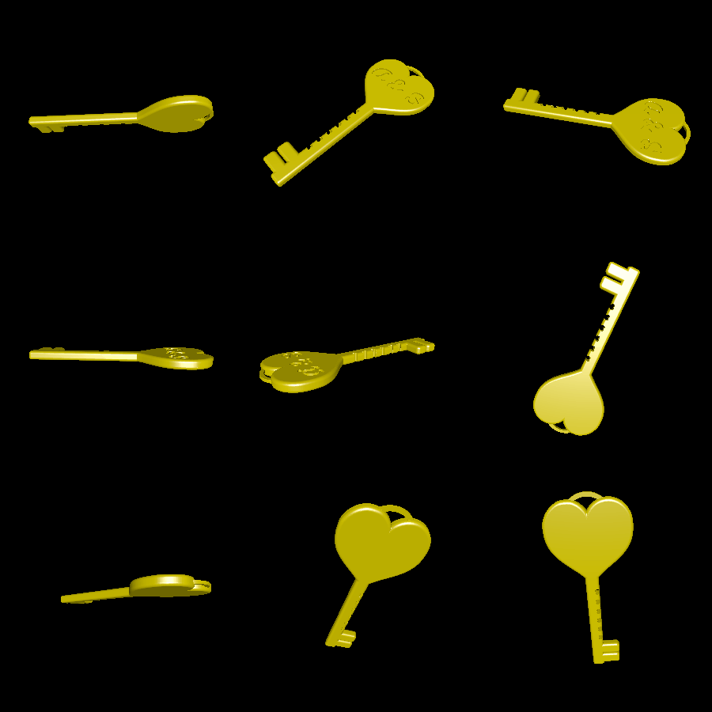

# key

This creates a romantic "love key", intended to be printed in a nice material (e.g. silver) and put on a keychain or necklace.

# Renderings

The key itself is created by first generating a 2D profile like so:

Then this profile is converted into a 3D solid with rounded edges. A thin hook is added to the top of the key. As a final touch, tiny hearts are cut out of the side to look like ridges on the key. The final result looks like so:

