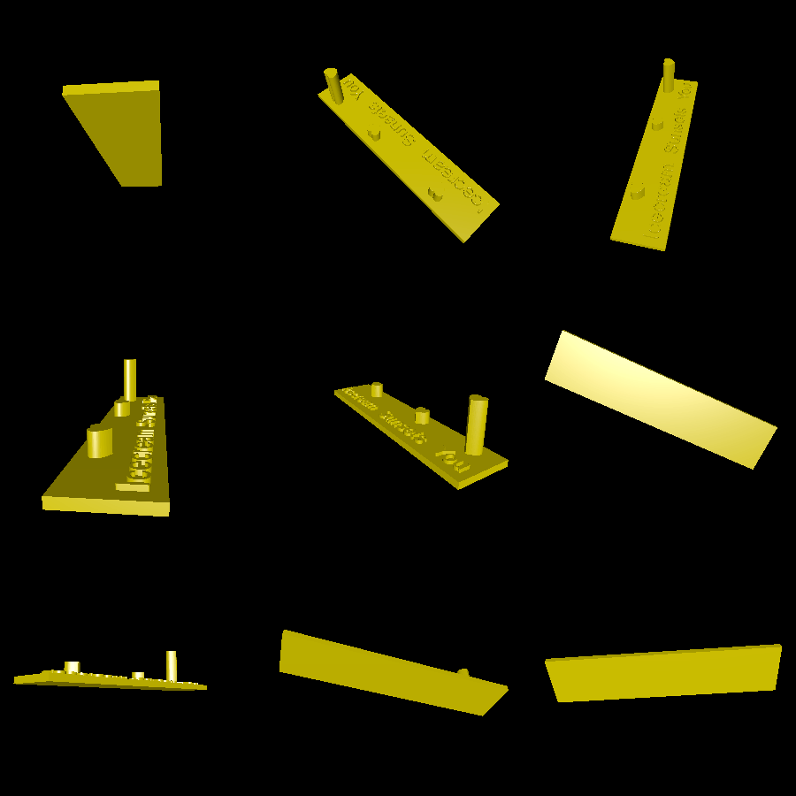

# love-graph

How do you compare your love for icecream and sunsets to your love for another person? Easy, plot it in a graph. This romantic gift tries to help visualize "how much more" you love your partner than you love other things.

This program produces a 3D bar graph with axis labels from the files [label1.png](label1.png) through [label3.png](label3.png). It uses a [heart shape](heart.png) as the profile for each "bar" in the bar graph.

# Renderings

