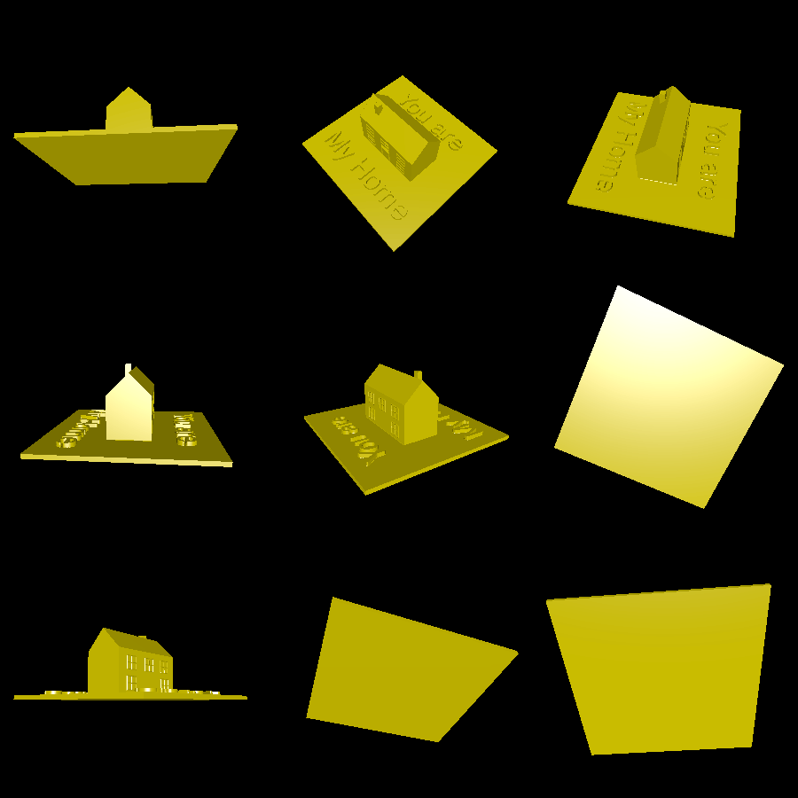

# my_home

This example creates a cute printable decoration that says "you are my home" with a 3D house on top. The design can be printed support-free on an FDM printer.

# Renderings

Here are renderings of the model:

