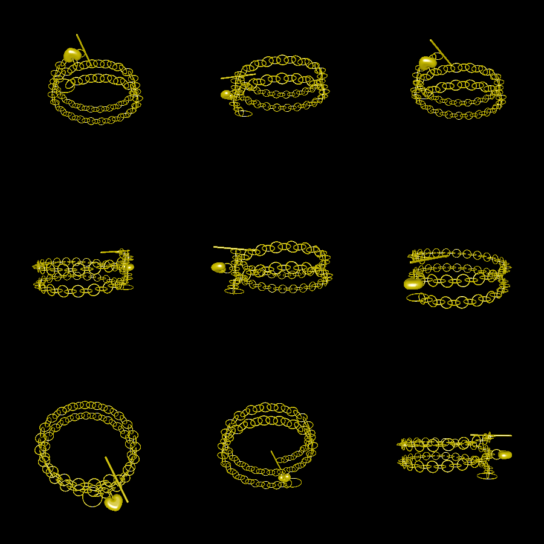
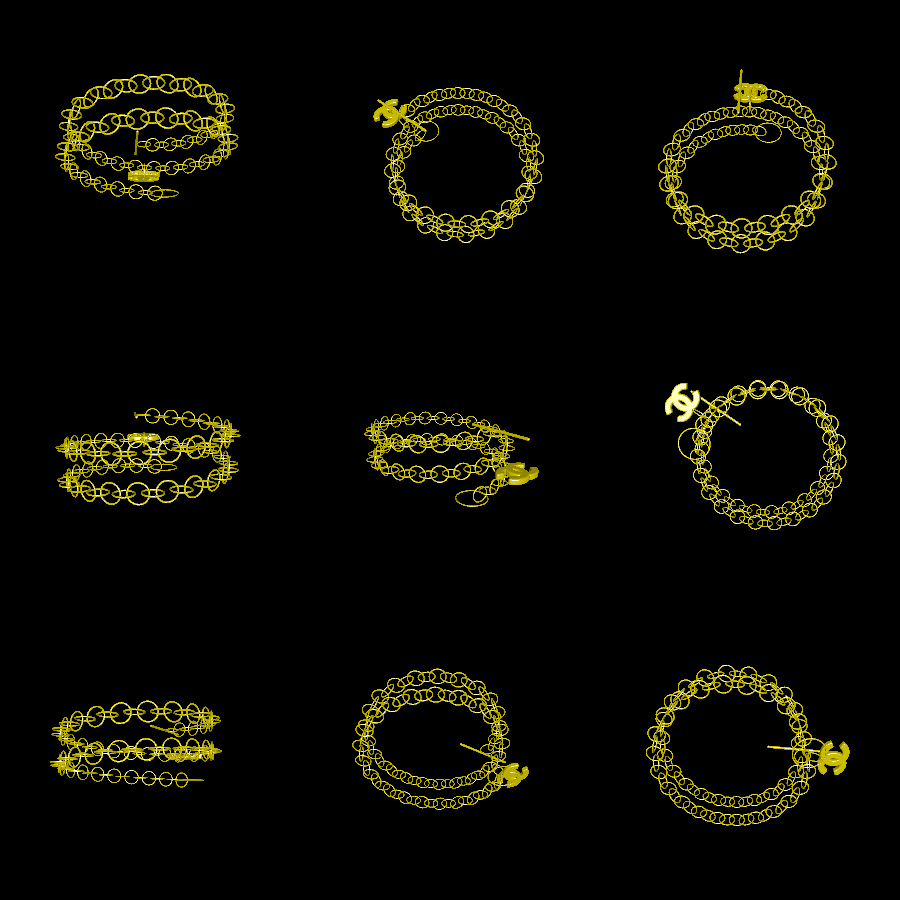

# necklace_2

This is a necklace that is intended to be printed with a support-free printing process, ideally out of metal. It is customizable using command-line arguments.

# Usage

By default, the command will produce a necklace model with a heart attached to it. The units are in inches. Simply run `go run .`:



To print with a custom attachment, you can use the `-attachment` argument. By default, this will turn a 2D shape into a 3D pendant. To engrave the pendant, use `file.png:engraving.png`. For example:

```
$ go run . -attachment example_attachments/chanel.png:example_attachments/chanel_engraving.png
```

Here's a rendering when using `example_attachments/chanel.png` as the attachment:



To produce the necklace in higher resolution, pass `-resolution 0.0025` (default 0.005), which will make the command take roughly eight times as long to execute. You can also make the links smaller (to simulate finer jewelry) by passing something like `-link-length 0.1` (default 0.2).
